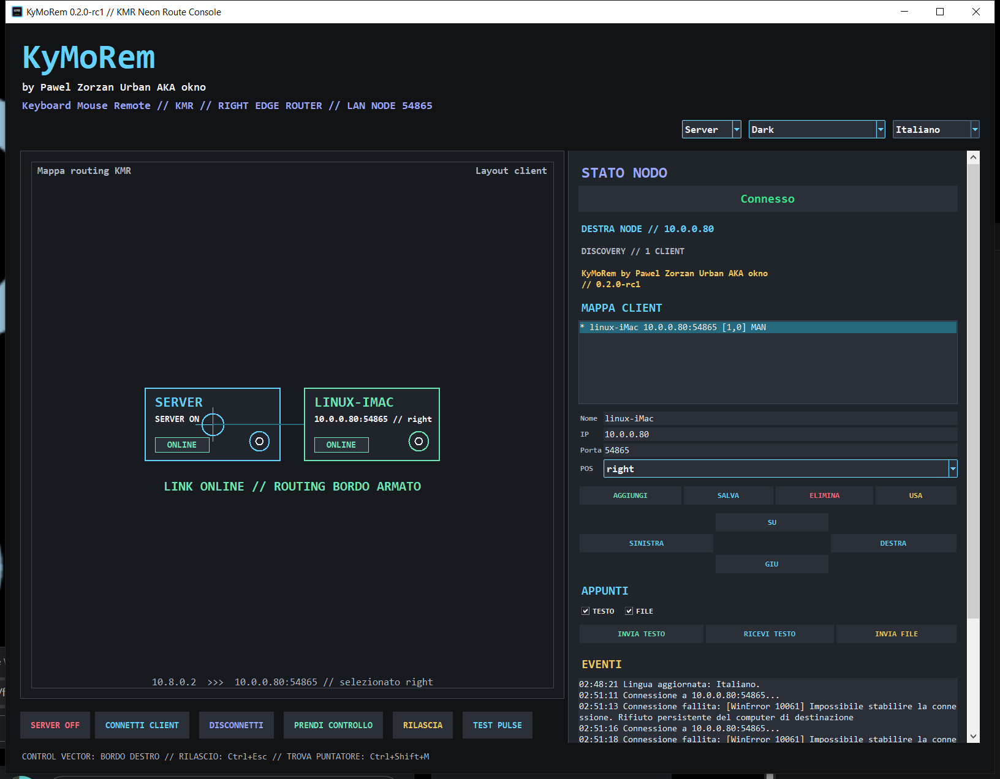

# KyMoRem

<p align="center">
  
</p>

KyMoRem, Keyboard Mouse Remote, is a LAN-first keyboard and pointer sharing
system for desktop machines and external devices. A host owns the physical
keyboard and mouse; approved clients receive authenticated, encrypted input
frames and inject them into their local graphical session.

KyMoRem follows the screen-edge workflow used by KVM tools such as Barrier, but
it does not copy Barrier source code and does not implement the Barrier/Synergy
wire protocol.



## Super Route Release

`v0.2.0-rc2` is the Super Route release for the Python runtime. It focuses on
the real multi-machine workflow: Windows host, Linux X11 clients and Windows 7
clients positioned on a shared route map.

### New capabilities

- Windows host route console with draggable client layout, `AGGIORNA` refresh
  action and centered Control Center window.
- Server-side approval model for clients. Unknown discovery clients stay
  pending and disabled; generated packages are pre-approved by the server.
- Editable layout grid. Move a client from the server UI, save, refresh, and
  routing follows the new coordinates on the next edge transition.
- Multi-hop edge routing between clients. Example: server -> linux-iMac ->
  windows7, or server -> windows7 below the host.
- Windows 7 x86/x64 client packaging with automatic secure token generation,
  sidecar token file, firewall helper, restart script and server registration.
- Linux client packaging for `/opt/kymorem` or user-level X11 daemon
  deployment.
- Safe endpoint switching. The host disconnects the previous active endpoint
  before taking control of another client, preventing stale Linux-to-Win7
  routing locks.
- Gamer-mouse scroll protection. Wheel bursts are coalesced, capped and cleared
  on release/switch so high-resolution infinite scroll cannot flood clients.
- Health inventory for configured clients, not only UDP discovery counters.
- Secure transport with AES-256-GCM, PSK/HKDF and ML-KEM-768 hybrid key
  establishment when the provider is available.
- Clipboard text and bounded file transfer over the encrypted session.
- Official IT, EN and CH quick-start documents plus a new official KMR logo.

Scaffolded targets remain in the repository for continued work:

- Rust protocol/core/agent workspace.
- Android app shell.
- macOS packaging templates.
- Windows MSI/Inno packaging recipes.
- Linux DEB and portable packaging recipes.

## Quick Start

### Windows host

1. Install `KyMoRem-0.2.0-rc2-windows-x64-setup.exe`.
2. Start KyMoRem and switch to `Server`.
3. Enable `SERVER ON`.
4. Open the route map, place approved clients on `right`, `left`, `up` or
   `down`, then save.
5. Press `AGGIORNA` after changing layout or after a client package announces
   itself.

KyMoRem refuses the development placeholder token by default. Use the package
generators below so the server creates or reuses a strong shared token.

### Windows 7 client package

Generate the package on the server:

```powershell
powershell -ExecutionPolicy Bypass -File .\scripts\New-KyMoRemWin7ClientPackage.ps1 -Arch x86 -Name windows7 -Direction down -Zip
```

Or extend an existing client:

```powershell
powershell -ExecutionPolicy Bypass -File .\scripts\New-KyMoRemWin7ClientPackage.ps1 -Arch x86 -Name windows7 -RelativeTo linux-iMac -Direction right -Zip
```

Copy `artifacts\win7-client-packages\windows7` or
`artifacts\win7-client-packages\windows7.zip` to Windows 7, then run
`Install-Firewall-And-Start.cmd` as Administrator. Daily starts can use
`Start-KyMoRem-Win7-Client.cmd`.

The package writes `kymorem-token.txt`, registers the client as approved in the
server config and can use `host=pending` until the first valid discovery packet
fills the real LAN IP.

### Linux X11 client package

Generate a Linux package from the server token:

```powershell
powershell -ExecutionPolicy Bypass -File .\scripts\New-KyMoRemLinuxClientPackage.ps1 -Name linux-iMac -ClientHost 10.0.0.80 -Zip
```

On Linux:

```bash
chmod +x *.sh
./Install-KyMoRem-Linux-Client.sh
systemctl --user status kymorem-client.service
```

Manual standalone mode is still supported:

```bash
tar -xzf KyMoRem-0.2.0-rc2-linux-x64-standalone.tar.gz
cd KyMoRem-linux-x64-standalone
export KYMOREM_TOKEN="use-a-long-shared-token"
./run-client.sh
```

### Direct Windows client mode

```powershell
KyMoRem.exe --client --bind 0.0.0.0 --port 54865 --name windows-client
```

## Network Model

```text
Windows host                  Linux/Windows client
UI + physical input      ->   local input injection
UDP discovery 54866      ->   encrypted LAN announcement
TCP session 54865        ->   secure input/control channel
configured screen edge   ->   remote control active
Ctrl+Esc/client edge     ->   release control
```

## Troubleshooting Snapshot

Most operational failures seen during rc2 testing fall into a small set of
checks:

- Windows 7 receives no events: regenerate the Win7 package from the server,
  run `Install-Firewall-And-Start.cmd` as Administrator, close older client
  windows and press `AGGIORNA` on the server.
- Secure handshake is rejected: host and client are not using the same token or
  an old client binary is still running. Use the generated `kymorem-token.txt`
  package, not manual environment variables.
- Server shows `0 client` but cards are online: UDP discovery may be blocked or
  stale, while TCP health still works. Use the configured client card, verify
  `54865/tcp`, then refresh.
- Layout was changed but routing still follows the old side: save the client
  slot, press `AGGIORNA`, release remote control with `Ctrl+Esc`, then enter
  again from the newly configured edge.
- Infinite-scroll mouse freezes input: install rc2 on host and clients. Wheel
  bursts are throttled and cleared on release/switch only in the updated path.
- Linux client is online but does not move: verify X11, `DISPLAY`,
  `.Xauthority` and `xdotool`; Wayland is not a production injection target.

Full operator FAQ: [FAQ.md](FAQ.md).

## Repository Layout

```text
runtime/python/              Working Windows/Linux/Win7 rc2 runtime
crates/kymorem-protocol/     Rust protocol structs and codec
crates/kymorem-core/         Rust layout/routing primitives
crates/kymorem-input/        Rust input abstraction
apps/kymorem-agent/          Rust CLI agent prototype
apps/android/                Android shell
install/                     Practical install scripts
packaging/                   Release packaging recipes
docs/                        Technical and operational documentation
docs/localized/              IT, EN and CH quick-start guides
assets/brand/                KMR brand assets
screenshot.png               README screenshot
```

## Documentation

- [FAQ and troubleshooting](FAQ.md)
- [Debugging](DEBUGGING.md)
- [IT quick start](docs/localized/README.it.md)
- [EN quick start](docs/localized/README.en.md)
- [CH quick start](docs/localized/README.ch.md)
- [IT FAQ](docs/localized/FAQ.it.md)
- [EN FAQ](docs/localized/FAQ.en.md)
- [CH FAQ](docs/localized/FAQ.ch.md)
- [Windows 7 onboarding](docs/windows7-client-onboarding.md)
- [Architecture](docs/architecture.md)
- [Configuration](docs/configuration.md)
- [LAN Discovery](docs/discovery.md)
- [Operations](docs/operations.md)
- [Security](SECURITY.md)
- [Release Process](docs/release.md)

Use KyMoRem only on trusted LANs. Keep `54865/tcp` and `54866/udp` limited to
private network segments.

## License

MIT.
